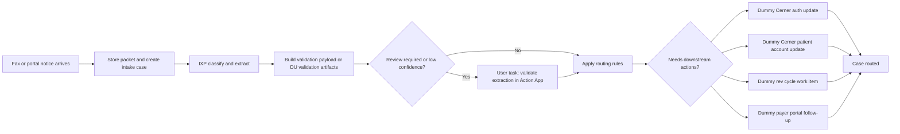

# KSWIC Payer Correspondence Maestro Flow

This demo flow keeps the platform boundary explicit:

- IXP classifies the incoming payer correspondence and extracts core fields.
- Maestro owns review gating, orchestration, and multi-system routing.
- Dummy downstream automations stand in for Cerner, payer portals, and rev cycle systems.
- A true reviewer step is modeled as a Maestro `User task` backed by an Action App.

## Review gate

- For the demo-safe starter flow, extraction review is required when confidence is low or when the team wants an explicit human sign-off before downstream work.
- In UiPath's supported implementation, the review step is a Maestro `User task` with `Create Action App task`.
- The Action App receives a `ContentValidationData` payload and pauses the process until the reviewer completes the task.
- The current repo emits interim reviewer payloads under `live_ixp/review_payloads.json` and `live_ixp/review_summary.md`.
- Those interim payloads are useful for design and review, but they are not yet `ContentValidationData`.

## Routing logic

- `denial_of_service = true` when a claim-side denial is extracted from payer correspondence.
- `payer_auth_problem = true` when a prior-auth or pharmacy-auth notice indicates an authorization-side follow-up.
- Cerner auth tasks are reserved for prior-auth and pharmacy-auth notices.
- Cerner patient-account notes are reserved for claim, COB, and payment-posting style notices.
- Rev cycle work items are reserved for denials, appeals, and recoupments.
- Payer-portal actions are reserved for status checks, uploads, reconsiderations, COB updates, and recoupment review.

## To make the review step live

1. Build or publish an RPA workflow that creates DU validation artifacts.
2. Build and publish an Action App task with `validationData` of type `ContentValidationData`.
3. Bind the Maestro `User task` to that Action App.
4. Route the reviewer-approved payload into the downstream smoke or production automations.
